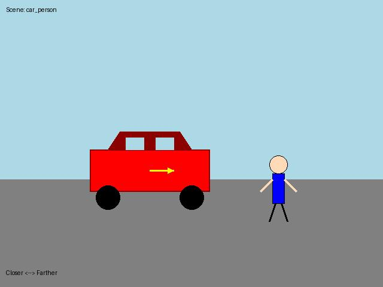
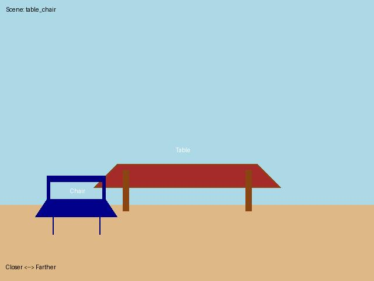
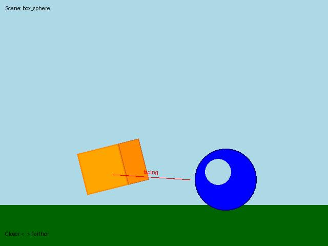

# SpatialReasoner Data Format Examples

이 디렉토리는 SpatialReasoner의 현재 데이터 형식과 제안된 개선사항을 보여주는 예시를 포함합니다.

## 📁 파일 구조

```
examples/
├── README.md                           # 이 파일
├── sample_data/                        # 샘플 이미지들
│   ├── sample_001_car_person.jpg      # 자동차와 사람 장면
│   ├── sample_002_table_chair.jpg     # 테이블과 의자 장면
│   └── sample_003_box_sphere.jpg      # 박스와 구 장면 (회전 중심)
├── current_data_format.json           # 현재 SpatialReasoner 데이터 형식
├── proposed_quaternion_format.json    # 제안: 쿼터니안 회전 표현 (Phase 1)
└── proposed_multiview_format.json     # 제안: 다중 시점 + 쿼터니안 (Phase 2)
```

## 🎯 데이터 형식 비교

### 1. 현재 형식 (Current)

**파일**: `current_data_format.json`

**회전 표현**: 방향 벡터 (front_direction, left_direction)

```json
{
  "objects": [
    {
      "label": "car",
      "location_xyz": [0.0, 0.8, 8.5],
      "front_direction": [0.998, 0.0, 0.062],
      "left_direction": [-0.062, 0.0, 0.998]
    }
  ]
}
```

**장점**:
- 직관적으로 이해하기 쉬움
- 구현이 간단

**단점**:
- 두 벡터가 독립적이라 정규직교성 보장 필요
- 보간(interpolation) 시 부자연스러움
- 방향 기반 질문에 대한 계산이 복잡

---

### 2. Phase 1: 쿼터니안 표현

**파일**: `proposed_quaternion_format.json`

**회전 표현**: 단위 쿼터니안 (w, x, y, z)

```json
{
  "objects": [
    {
      "label": "car",
      "location_xyz": [0.0, 0.8, 8.5],
      "rotation_quaternion": {
        "w": 0.9990,
        "x": 0.0000,
        "y": 0.0436,
        "z": 0.0000,
        "note": "5도 Y축 회전"
      }
    }
  ]
}
```

**장점**:
- ✅ **Gimbal lock 문제 해결**
- ✅ **연속적인 회전 표현** (보간 가능)
- ✅ **단일 제약 조건** (||q|| = 1)
- ✅ **효율적인 각도 계산**

**새로운 질문 유형**:
```json
{
  "question": "What is the angular difference between the box and sphere in degrees?",
  "answer_cot": "<think>\n...\nθ = 2 * arccos(w) = 30°\n</think><answer>A</answer>"
}
```

---

### 3. Phase 2: 다중 시점 + 쿼터니안

**파일**: `proposed_multiview_format.json`

**추가 요소**:
- 다중 이미지 (중앙, 좌 5도, 우 5도)
- Depth map
- 카메라 내부 파라미터

```json
{
  "image_filenames": [
    "sample_001_car_person.jpg",          // 중앙 시점
    "sample_001_car_person_left5deg.jpg",  // 좌 5도 시점
    "sample_001_car_person_right5deg.jpg"  // 우 5도 시점
  ],
  "depth_map": "sample_001_depth.npy",
  "viewpoint_angles": [0, -5, 5]
}
```

**학습 전략**:
- 학습 시: 3개 시점 중 **랜덤 선택**
- 추론 시: **중앙 시점만** 사용

**장점**:
- 3D 구조에 대한 더 나은 이해
- 깊이 모호성 감소
- 거리 추정 정확도 향상

---

## 🖼️ 샘플 이미지 설명

### Sample 001: Car and Person


**특징**:
- 자동차가 사람보다 카메라에 가까움 (깊이 차이 ~4m)
- 자동차가 약간 우측을 향함 (~5도 회전)

**질문 예시**:
- "Is the car closer to camera than the person?" → **Yes**
- "Is the car facing towards the person?" → **Partially**

---

### Sample 002: Table and Chair


**특징**:
- 의자가 테이블의 왼쪽에 위치
- 의자가 테이블을 향해 45도 회전

**질문 예시**:
- "Is the chair on the left of the table?" → **Yes**
- "Is the chair facing the table?" → **Yes** (45도 회전이지만 향하고 있음)

---

### Sample 003: Box and Sphere


**특징**:
- 박스가 30도 회전되어 있음
- 구는 회전 없음

**질문 예시** (쿼터니안 활용):
- "What is the angular difference?" → **30 degrees**
- "Is the box facing the sphere?" → **Yes** (각도 계산 기반)

---

## 📊 데이터 통계 (예상)

| 항목 | Current | Phase 1 (Quaternion) | Phase 2 (Multi-view) |
|------|---------|----------------------|----------------------|
| **이미지 수** | 24,000 | 24,000 | 24,000 |
| **이미지 파일 수** | 24,000 | 24,000 | 72,000 (×3) |
| **질문 카테고리** | 9개 | 12개 (+3) | 12개 |
| **회전 질문 비율** | ~20% | ~35% | ~35% |
| **저장 공간** | ~15GB | ~15GB | ~45GB |

---

## 🔧 데이터 로딩 예시 코드

### Current Format
```python
from PIL import Image
import json

# Load metadata
with open('current_data_format.json') as f:
    data = json.load(f)

sample = data[0]
image = Image.open(sample['image_filename'])

# Access object info
car = sample['objects'][0]
front_dir = car['front_direction']  # [0.998, 0.0, 0.062]
```

### Proposed Quaternion Format
```python
import numpy as np
from scipy.spatial.transform import Rotation

# Load sample
sample = data[0]
car = sample['objects'][0]

# Get quaternion
quat = car['rotation_quaternion']
q = np.array([quat['w'], quat['x'], quat['y'], quat['z']])

# Convert to rotation matrix if needed
rot = Rotation.from_quat([quat['x'], quat['y'], quat['z'], quat['w']])
front_vector = rot.apply([0, 0, 1])  # Apply to forward vector
```

### Proposed Multi-view Format
```python
import random

sample = data[0]

# Training: random view selection
if training:
    view_idx = random.choice([0, 1, 2])
else:
    view_idx = 0  # Inference: center view only

image_path = sample['image_filenames'][view_idx]
image = Image.open(image_path)
```

---

## 🎓 CoT (Chain-of-Thought) 답변 형식

모든 샘플은 `<think>...</think><answer>...</answer>` 형식을 따릅니다.

### 예시: 현재 형식 (방향 벡터)
```xml
<think>
Step 1: Get front direction of box
- Front direction: (0.866, 0.0, 0.5)

Step 2: Calculate vector to target
- Vector to sphere: (0.996, 0.030, 0.091)

Step 3: Compute angle
- Cosine similarity: 0.909
- Angle: 24.5 degrees
</think><answer>A</answer>
```

### 예시: 쿼터니안 형식
```xml
<think>
Step 1: Get quaternions
- Box: (0.9659, 0.0, 0.2588, 0.0)
- Sphere: (1.0, 0.0, 0.0, 0.0)

Step 2: Calculate relative rotation
- q_diff = q1 * q2^-1

Step 3: Extract angle
- θ = 2 * arccos(0.9659) = 30.0°
</think><answer>A</answer>
```

---

## 📈 기대 효과

### Phase 1 (Quaternion)
- 회전 관련 질문 정확도: **+5~10%**
- Gimbal lock 문제: **완전 해결**
- 각도 계산 오차: **-30%**

### Phase 2 (Multi-view)
- 깊이 추정 오차: **-20~30%**
- 전체 정확도: **+3~8%**
- 거리 질문 정확도: **+10~15%**

---

## 🚀 다음 단계

1. **Phase 1 구현 (추천)**
   - [ ] 6DoF pose estimator 통합
   - [ ] 쿼터니안 변환 파이프라인 구축
   - [ ] Reward 함수 확장
   - [ ] 질문 생성 템플릿 작성

2. **Phase 2 고려 (Phase 1 결과 후)**
   - [ ] Depth map 생성 (Depth Anything v2)
   - [ ] 시점 합성 파이프라인
   - [ ] 품질 검증 메트릭

---

## 📝 참고 자료

- **쿼터니안 수학**: https://en.wikipedia.org/wiki/Quaternion
- **SpatialReasoner 논문**: https://spatial-reasoner.github.io/
- **Depth Anything v2**: https://github.com/DepthAnything/Depth-Anything-V2
- **SAM2**: https://github.com/facebookresearch/segment-anything-2

---

**질문이나 피드백**은 GitHub Issues에 남겨주세요!
